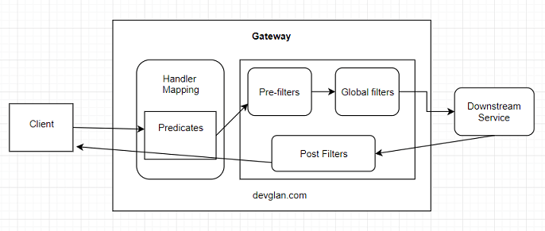
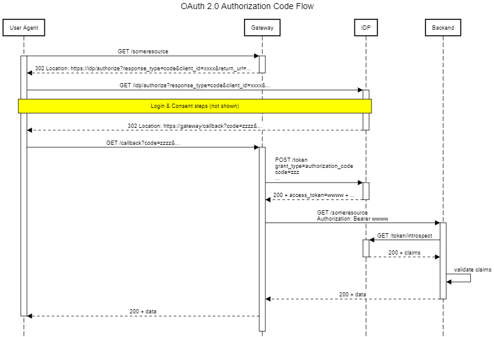
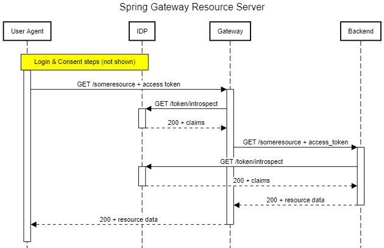
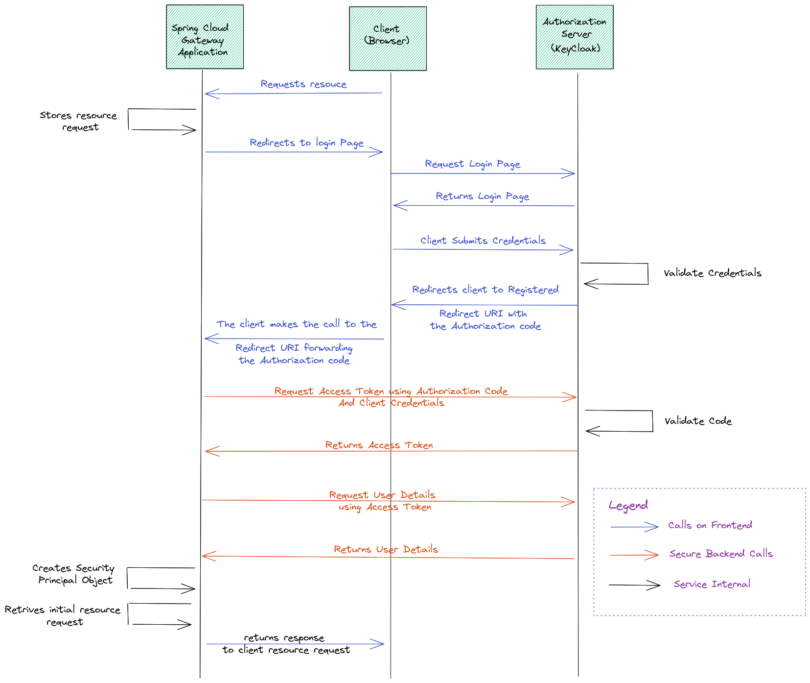

https://cloud.spring.io/spring-cloud-gateway/reference/html/#gateway-starter

A Blocking gateway such as Zuul1 requires as many threads as no of requests to handle requests coming to an API gateway and hence a lot of resources is required to handle these requests. Any extra requests simply sit in the queue and wait until a working thread completes its execution. Whereas in case of non-blocking, the main thread is always available to serve the request and other multiple threads process those requests asynchronously in the background and once the request is completely processed the response is returned. Hence non-blocking model requires a less no of resources to serve the same amount of requests as compared to blocking gateway.

Spring cloud gateway is a non-blocking reactive gateway similar to Zuul2 but spring cloud does not provide any out of the box integration with Zuul2.

Once a request reaches to the gateway, the first thing gateway does is to match the request with each of the available route based on the predicate defined. Once, the route has matched the request moves to web handler and the filters will be applied to the request. There are many out of the box filters provided by the gateway itself to modify the request header as well as the body. Pre-filters are applied specifically to a route whereas global filters can be applied to all the route request. Global filters can be applied to perform authentication and authorization of all the request at one place. 

Create a client with standard flow enabled in Keycloak - OAuth2 connect id approach 